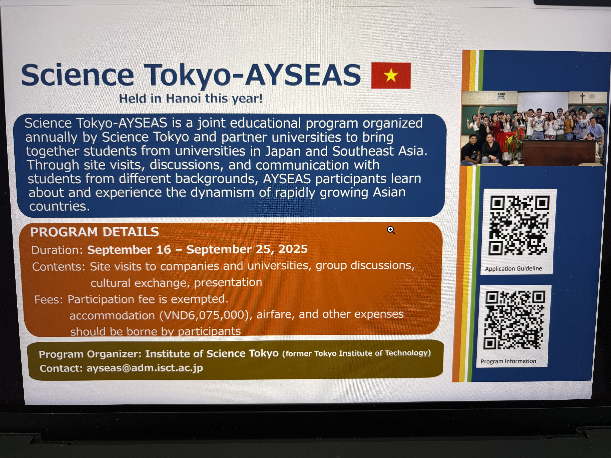
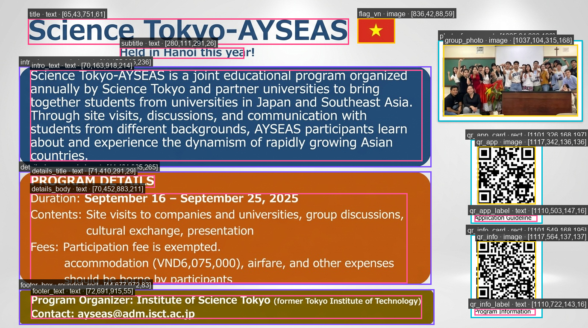
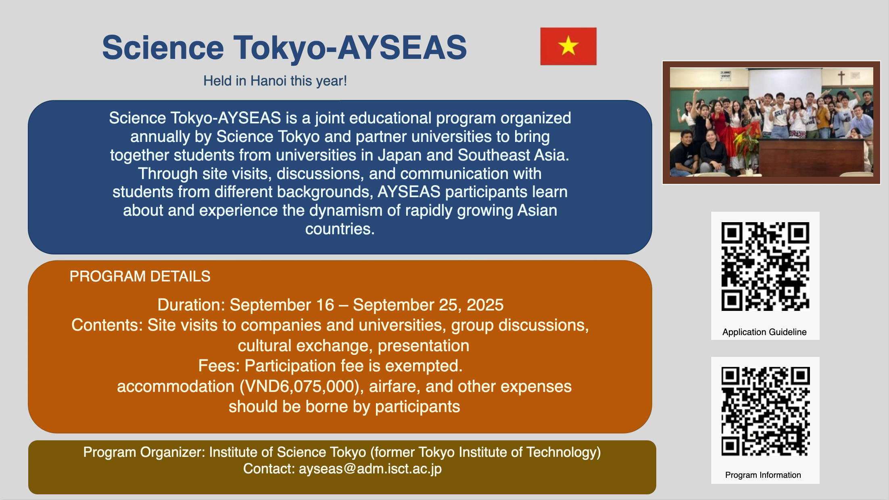
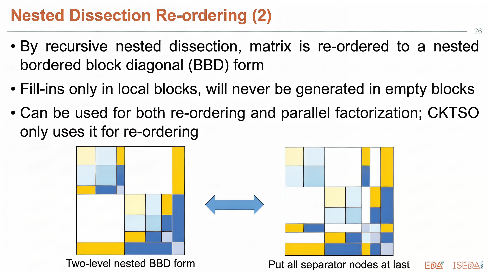

# img2ppt

[English](README.md)

把幻灯片图片重建成可编辑的 `.pptx`。

## 效果展示

下面是仓库内 3 组示例，从原始拍摄图，到前处理后的幻灯片图，再到最终 PPTX 的展示效果。

| 原始拍摄图 | 前处理后图片 | PPTX 效果图 |
| --- | --- | --- |
|  |  |  |
|  |  |  |
|  |  |  |

目录说明：

- `raw-images/`：原始拍摄图，比如投影、屏幕、会场照片。
- `images/`：前处理后的图片，更接近干净的 PPT 截图，适合作为主输入。
- `display/`：最终 PPTX 的展示截图，只用于效果展示，不是自动生成目录。
- `outputs/`：程序运行后的实际输出目录，包含 AST、裁剪图、中间产物和 `.pptx`。

## 安装

```bash
cp .env.example .env
pip install -r requirements.txt
npm install
```

然后在 `.env` 中填好模型配置：

```env
VLM_MODEL_NAME=qwen2.5-vl-72b-instruct
VLM_MODEL_BASE_URL=https://dashscope.aliyuncs.com/compatible-mode/v1
VLM_MODEL_API_KEY=your_vlm_api_key

REASONING_MODEL_NAME=qwen3-235b-a22b
REASONING_MODEL_BASE_URL=https://dashscope.aliyuncs.com/compatible-mode/v1
REASONING_MODEL_API_KEY=your_reasoning_api_key

OCR_FAILURE_MODE=continue

NANOBANANA_PRO_MODEL_NAME=google/gemini-3-pro-image-preview
NANOBANANA_PRO_BASE_URL=https://openrouter.ai/api/v1
NANOBANANA_PRO_API_KEY=your_openrouter_or_compatible_api_key

LOG_LEVEL=INFO
LOG_FILE=outputs/logs/img2ppt.log
```

## 直接运行

### 处理一张已经规整好的图片

```bash
python -m backend.pipeline images/good1.jpg --out outputs/ppt/good1.pptx
```

### 批量处理 `images/`

```bash
python -m backend.pipeline images --out outputs/ppt
```

### 从原始拍摄图开始处理

输入是 `raw-images/` 时，会先自动做 raw image 前处理，再进入后续识别和 PPT 生成流程。

```bash
python -m backend.pipeline raw-images --out outputs/ppt
```

也可以手动开关前处理：

```bash
python -m backend.pipeline photos --preprocess-raw-images --out outputs/ppt
python -m backend.pipeline raw-images --no-preprocess-raw-images --out outputs/ppt
```

### 不调用模型的烟测

只验证本地链路是否能跑通：

```bash
python -m backend.pipeline images/good1.jpg \
  --mock-layout \
  --skip-ocr \
  --out outputs/ppt/mock.pptx
```

## 运行逻辑

### 1. 输入图片

可以输入单张图片，也可以输入目录。

- 输入 `images/good1.jpg`：只处理这一张。
- 输入 `images/`：按文件名排序，逐张生成 PPTX。
- 输入 `raw-images/`：每张图先做前处理，再生成 PPTX。

支持的图片格式：

```text
.png .jpg .jpeg .webp .bmp .tif .tiff
```

### 2. Raw Image 前处理

只有在以下情况会启用：

- 输入目录名是 `raw-images`
- 输入图片位于 `raw-images/`
- 显式传入 `--preprocess-raw-images`

它会把现场拍摄图转换成更干净的 PPT 风格图片。前处理结果保存在：

```text
outputs/intermediates/<name>_<timestamp>/00_raw_image_preprocess/
```

### 3. 识别和重建

后续流程按顺序执行：

```text
图片尺寸读取
→ Layout VLM 解析页面元素
→ OCR 补充文本
→ Reasoning 修正 AST
→ OpenCV 提取样式
→ 裁剪复杂图片元素
→ 保存最终 AST
→ 编译成 PPTX
```

生成的 PPTX 中会尽量保留可编辑对象：

- 文本生成 PPT 文本框
- 矩形生成 PPT 形状
- 圆角矩形生成 PPT 形状
- 线条生成 PPT 线条
- logo、icon、复杂图表等裁剪成图片插入

### 4. 输出文件

默认输出会带时间戳，避免覆盖旧结果。

常见输出：

- `outputs/ppt/*.pptx`：最终可编辑 PPTX。
- `outputs/ast/*_ast.json`：最终 Slide AST。
- `outputs/crops/*/`：复杂元素裁剪图。
- `outputs/intermediates/*/`：每一步的中间产物和调试图。
- `outputs/logs/img2ppt.log`：运行日志。

中间产物里最常看的文件：

- `02_after_layout_boxes.png`：Layout 阶段 bbox 可视化。
- `03_after_ocr_boxes.png`：OCR 合并后的 bbox 可视化。
- `05_after_style_ast.json`：样式提取后的 AST。
- `06_crops.json`：被裁剪为图片的元素列表。
- `07_final_ast.json`：最终 AST。
- `08_compile.json`：PPTX 编译结果。

## 常用参数

```bash
# 跳过 OCR
python -m backend.pipeline images/good1.jpg --skip-ocr --out outputs/ppt/good1.pptx

# 强制启用推理修正
python -m backend.pipeline images/good1.jpg --use-reasoning --out outputs/ppt/good1.pptx

# 关闭推理修正
python -m backend.pipeline images/good1.jpg --skip-reasoning --out outputs/ppt/good1.pptx

# 只生成 AST 和裁剪图，不编译 PPTX
python -m backend.pipeline images/good1.jpg --skip-compile

# 指定中间产物目录
python -m backend.pipeline images/good1.jpg \
  --artifact-dir outputs/intermediates/debug-run \
  --out outputs/ppt/good1.pptx
```

## API

启动服务：

```bash
uvicorn backend.server:app --reload
```

上传图片并返回 PPTX：

```bash
curl -F "file=@images/good1.jpg" -o result.pptx http://127.0.0.1:8000/convert
```

健康检查：

```bash
curl http://127.0.0.1:8000/health
```

## 许可证

MIT License，见 [LICENSE](LICENSE)。
